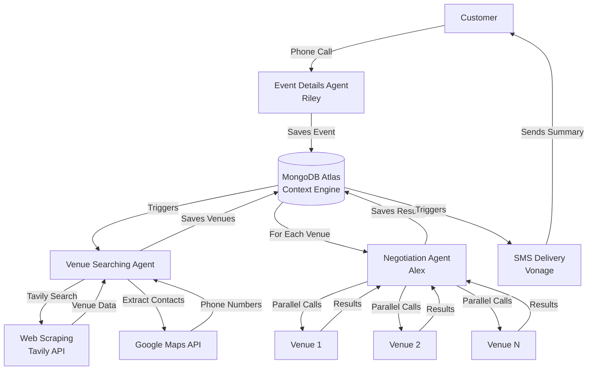

# EventPilot

**Automate corporate event planning from months to minutes with a multi-agent system.**

EventPilot transforms the labor-intensive process of corporate event planning into a fully automated workflow. Through a single phone call, clients describe their event requirements, and our multi-agent system handles venue discovery, negotiation, and delivery—reducing weeks of manual research and communication to minutes.

## The Problem

Corporate event planning is a time-consuming process that typically involves:

- Hours of web research to find suitable venues
- Multiple phone calls to verify availability and pricing
- Manual negotiation attempts to secure better rates
- Coordinating communication across multiple vendors
- Compiling results for stakeholder review

This process can take operations teams weeks to months, with significant opportunity costs and no guarantee of optimal pricing.

## The Solution

EventPilot automates the entire workflow through a coordinated multi-agent system. Clients make one phone call to describe their event, and the system:

1. **Collects** event requirements through a conversational voice agent
2. **Discovers** suitable venues using intelligent web scraping
3. **Negotiates** with venues in parallel to secure optimal pricing (typically 10-15% savings)
4. **Delivers** curated results via SMS automatically

All orchestrated through MongoDB as a shared context engine, enabling seamless state management across agents.

## How It Works

## Architecture

EventPilot is built on a multi-agent architecture where specialized agents collaborate through a shared context layer.

### Agent Responsibilities

**Event Details Agent (Riley)**

- Voice agent powered by Vapi and GPT-4o
- Conducts natural conversation to collect event requirements
- Validates and structures data before persistence
- Fields: event name, dates, attendee count, venue type, location, budget, amenities

**Venue Searching Agent**

- Orchestrates venue discovery through multiple data sources
- Uses Tavily API for intelligent web scraping and content extraction
- Leverages Google Maps API to extract venue contact information
- Filters venues based on capacity, budget, and location constraints
- Employs GPT-4o-mini for structured data extraction from unstructured web content

**Negotiation Agent (Alex)**

- Voice agent that autonomously calls venues
- Retrieves event context from MongoDB at call start
- Conducts availability checks, capacity verification, and pricing discussions
- Implements negotiation strategies when quoted prices exceed budget thresholds
- Executes parallel calls to multiple venues simultaneously
- Persists negotiation outcomes with structured status tracking

### Context Management

MongoDB Atlas serves as the central context engine, enabling:

- **State Persistence**: Event data, venue lists, and negotiation results stored as documents
- **Agent Coordination**: Agents read and write to shared documents, maintaining consistency
- **Async Orchestration**: FastAPI background tasks trigger agent workflows based on state changes
- **Result Aggregation**: Final SMS generation pulls from complete event and negotiation data

### Orchestration Layer

The FastAPI server (`server.py`) provides:

- REST endpoints for Vapi tool integrations
- Background task management for async agent execution
- Health check endpoints for system monitoring
- CORS configuration for web dashboard integration

## Technical Stack

| Component         | Technology           | Purpose                                               |
| ----------------- | -------------------- | ----------------------------------------------------- |
| **Language**      | Python 3.x           | Core application logic                                |
| **Framework**     | FastAPI              | REST API and orchestration                            |
| **LLM**           | GPT-4o / GPT-4o-mini | Agent reasoning and data extraction                   |
| **Voice Agents**  | Vapi                 | Conversational AI for customer and venue interactions |
| **Web Search**    | Tavily               | Intelligent web scraping and content extraction       |
| **Places API**    | Google Maps          | Venue contact information extraction                  |
| **SMS**           | Vonage               | Automated result delivery                             |
| **Database**      | MongoDB Atlas        | Agent context engine and state persistence            |
| **Transcription** | Deepgram             | Real-time speech-to-text for voice agents             |

## Key Features

- **Voice-First Interaction**: Natural language event specification through phone calls
- **Intelligent Venue Discovery**: Multi-source data aggregation with AI-powered filtering
- **Automated Negotiation**: Parallel venue outreach with strategic pricing discussions
- **Cost Optimization**: Typically secures 10-15% savings through systematic negotiation
- **Automated Delivery**: SMS summaries generated and sent without manual intervention
- **Context Persistence**: MongoDB enables reliable state management across async operations
- **Scalable Architecture**: Parallel agent execution handles multiple venues simultaneously

## Agent Configuration

Each voice agent is configured through:

- `system_prompt.md`: Defines agent personality, behavior, and conversation flow
- `tools.json`: Specifies function calling schemas and server endpoints
- `assistant_config.json`: Configures voice, model, and transcription settings
- `create_agent.py`: Scripts to deploy agents to Vapi platform

The system supports multiple specialized agents:

- `event_details_agent/`: Customer-facing event collection
- `negotiation_agent/`: Venue outreach and negotiation
- `venue_searching_agent/`: Web scraping and data extraction
- `health_check_agent/`: System monitoring and diagnostics
