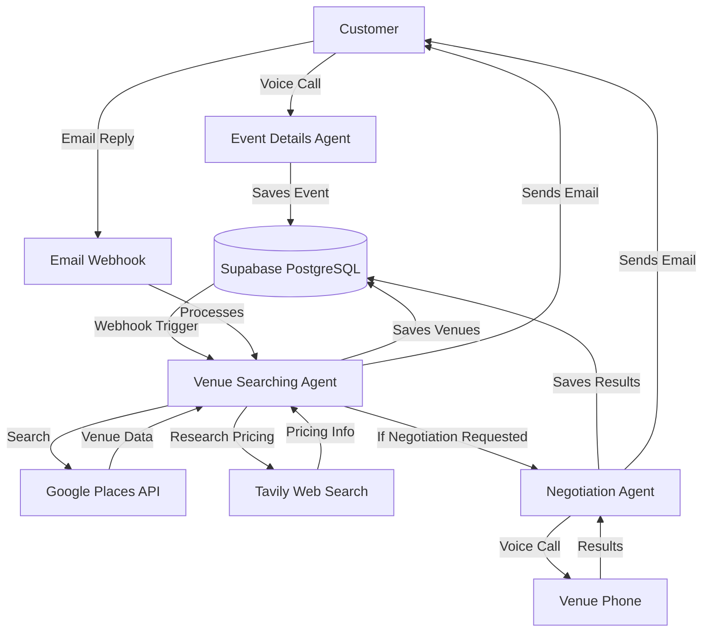

# EventPilot

**Automate corporate event planning from months to minutes with a multi-agent system.**

EventPilot transforms the labor-intensive process of corporate event planning into a fully automated workflow. Through a single phone call, clients describe their event requirements, and our multi-agent system handles venue discovery, negotiation, and delivery—reducing weeks of manual research and communication to minutes.

## The Problem

Corporate event planning is a time-consuming process that typically involves:

- Hours of web research to find suitable venues
- Multiple phone calls to verify availability and pricing
- Manual negotiation attempts to secure better rates
- Coordinating communication across multiple vendors
- Compiling results for stakeholder review

This process can take operations teams weeks to months, with significant opportunity costs and no guarantee of optimal pricing.

## The Solution

EventPilot automates the entire workflow through a coordinated multi-agent system that combines voice calls and email interactions. The process unfolds in three phases:

1. **Event Collection (Voice)**: Conversational voice agent collects event requirements through a natural phone conversation
2. **Venue Discovery (Email)**: Automated venue search using Google Places and web research, with results delivered via email
3. **Negotiation (Voice, Optional)**: AI agent calls venues on behalf of the client to negotiate availability and pricing

All coordinated through Supabase PostgreSQL as the central data store, enabling seamless state management across agents.

## How It Works

### Phase 1: Event Collection (Voice)

The customer calls EventPilot and speaks with an AI agent named "Andrew" for a 5-10 minute conversation:

- Collects event details: location, venue type, dates, attendees, budget, amenities
- Validates dates and information through natural conversation
- Saves structured event data to the database
- Automatically triggers venue search after call ends

### Phase 2: Venue Discovery (Email)

The system automatically searches for suitable venues and sends results via email:

- Searches Google Places API for venues matching criteria
- Researches pricing information through web search (Tavily)
- Sends personalized email with curated venue recommendations
- Customer can reply via email to:
  - Ask questions about specific venues
  - Request additional searches with different criteria
  - Request negotiations with selected venues

### Phase 3: Negotiation (Voice, Optional)

When requested, the system calls venues on behalf of the customer:

- Creates a custom negotiation agent for each venue with full event context
- AI agent calls venue to discuss availability, capacity, and pricing
- Conducts professional negotiation if pricing exceeds budget
- Emails detailed results back to customer

### System Architecture Flow

## Challenges and Solutions

Building a production-ready multi-agent system required solving several complex technical challenges:

### Challenge 1: Voice Agent Reliability

**Problem**: Ensuring voice agents consistently follow conversation flows, extract correct information, and handle edge cases (unclear responses, date validation, budget ranges).

**Solution**:
- Structured system prompts with explicit sequential conversation steps
- Sequential information gathering to reduce complexity (one question at a time)
- Built-in validation via function calling (e.g., `get_current_datetime` for date validation)
- End-call phrase detection ("goodbye", "talk to you soon") to gracefully terminate conversations
- Temperature tuning (0.5) to balance creativity with consistency

### Challenge 2: Context Management Across Agents

**Problem**: Three specialized agents (two voice, one email) operating asynchronously need to share event, venue, and negotiation state without conflicts or data loss.

**Solution**:
- Supabase PostgreSQL as centralized state store with ACID guarantees
- Normalized schema with proper foreign keys ensuring referential integrity (`users` → `events` → `venues` → `negotiations`)
- Event-specific email addresses (`event+{event_id}@domain.com`) for automatic routing and context loading
- Agents load context on-demand using event/venue IDs rather than passing data between agents
- Email message history stored in database for conversation continuity

### Challenge 3: Webhook Orchestration

**Problem**: Coordinating asynchronous workflows across voice calls (VAPI) and email (Resend) systems with different callback mechanisms and timing.

**Solution**:
- FastAPI webhook endpoints for VAPI (`/event_details/webhook`, `/negotiation/webhook`) process call completion events
- Resend webhook (`/venue_search/webhook`) handles incoming email and triggers agent processing
- Background tasks for long-running operations (venue search after call) prevent webhook timeouts
- Dynamic VAPI assistant creation/deletion per negotiation to manage API resources and prevent conflicts
- Structured data extraction using LangChain to parse unstructured voice transcripts into database records

## Architecture

EventPilot is built on a multi-agent architecture where specialized agents collaborate through webhooks and a shared database.

### Agent Responsibilities

**Event Details Agent (Andrew)**

- Voice agent powered by VAPI and GPT-4o
- Conducts natural conversation to collect event requirements
- Validates and structures data before persistence
- Uses function calling to save user and event information
- Triggers venue search automatically via webhook when call ends
- Collects: dates, attendee count, venue type, location, budget, amenities

**Venue Searching Agent**

- Email-based agent built with LangChain and GPT-4o-mini
- Orchestrates venue discovery through multiple data sources
- Uses Google Places API to search venues by location and type
- Leverages Tavily API for web search to find pricing information
- Processes customer email replies through LangChain tool-calling
- Can trigger negotiations when customer requests it via email

**Negotiation Agent (Andrew)**

- Voice agent that autonomously calls venues
- Dynamically created per venue with full event context injected
- Retrieves historical negotiation data to inform strategy
- Conducts availability checks, capacity verification, and pricing discussions
- Implements negotiation tactics when quoted prices exceed budget
- Uses LangChain structured output extraction to parse call transcripts
- Automatically deleted after negotiation completes to manage resources

### Data Management

Supabase PostgreSQL serves as the central data store with a normalized schema:

- **users**: Customer information (name, email, phone, company)
- **events**: Event requirements and details (dates, attendees, budget, venue type, location)
- **venues**: Discovered venues with Google Places data (name, address, phone, rating, pricing)
- **negotiations**: Negotiation outcomes (initial quotes, counteroffers, final quotes, contact person)
- **email_messages**: Email conversation history for context continuity

Foreign key relationships maintain data integrity: `users` → `events` → `venues` → `negotiations`

### Orchestration Layer

The FastAPI server (`server.py`) provides:

- REST endpoints for VAPI tool integrations (function calling)
- Webhook endpoints for VAPI (call completion) and Resend (email receipt)
- Background task management for async venue search execution
- Email routing using event-specific addresses (`event+{event_id}@domain.com`)
- Health check endpoints for system monitoring

## Technical Stack

| Component            | Technology                  | Why We Chose It                                                              |
| -------------------- | --------------------------- | ---------------------------------------------------------------------------- |
| **Language**         | Python 3.x                  | Rich AI/ML ecosystem, excellent library support, FastAPI compatibility       |
| **Framework**        | FastAPI                     | Modern async API, webhook handling, automatic OpenAPI documentation          |
| **Database**         | Supabase (PostgreSQL)       | Structured schema for complex queries, managed infrastructure, data integrity|
| **LLM**              | OpenAI GPT-4o / GPT-4o-mini | Industry-leading reasoning, reliable function calling, cost tiers            |
| **Voice Platform**   | VAPI                        | Built-in LLM integration and function calling, faster development            |
| **Agent Framework**  | LangChain                   | Tool orchestration for email agent, structured output extraction             |
| **Voice-to-Text**    | Deepgram Nova-3             | Real-time transcription integrated with VAPI                                 |
| **Web Search**       | Tavily                      | Purpose-built for AI agents, returns structured data from web searches       |
| **Places Data**      | Google Maps API             | Comprehensive venue database, contact information, ratings, location data    |
| **Email**            | Resend                      | Developer-friendly API, webhook support for receiving emails, reliable       |

### Key Architecture Decisions

**Multi-modal Communication**: We chose voice for high-touch interactions (initial collection, negotiation) where natural conversation creates better UX, and email for research and follow-up where customers need time to review options.

**Specialized Agents**: Rather than building one general-purpose agent, we created three specialized agents optimized for specific tasks. This allows for simpler prompts, better reliability, and easier debugging.

**Dynamic Agent Creation**: Negotiation agents are created per-venue with event context injected into the system prompt. This ensures each negotiation has full context without complex state management.

**Webhook-Driven Architecture**: Loose coupling between agents through webhooks enables independent scaling, easier testing, and clearer separation of concerns.

## Key Features

- **Multi-Modal Interaction**: Combines voice calls for high-touch moments with email for research and follow-up
- **Voice-First Collection**: Natural language event specification through conversational phone calls
- **Intelligent Venue Discovery**: Multi-source data aggregation from Google Places and web search
- **Automated Negotiation**: AI agent calls venues on behalf of customers to negotiate terms and pricing
- **Email-Based Follow-Up**: Interactive email conversations for venue questions and negotiation requests
- **Context Persistence**: Supabase PostgreSQL ensures reliable state management across async operations
- **Dynamic Agent Creation**: Negotiation agents created on-demand with full event context

## Agent Configuration

### Voice Agents (VAPI)

The Event Details and Negotiation agents are VAPI voice agents configured through:

- `system_prompt.md`: Defines agent personality, behavior, and conversation flow
- `tools.json`: Specifies function calling schemas and FastAPI server endpoints
- `assistant_config.json`: Configures voice (Elliot), model (GPT-4o), and transcription (Deepgram Nova-3)
- `create_vapi_agent.py`: Script to deploy agents to VAPI platform

Voice agent directories:
- `event_details_agent/`: Customer-facing event collection via phone
- `negotiation_agent/`: Venue outreach and negotiation via phone (dynamically created per venue)

### Email Agent (LangChain)

The Venue Searching agent is a LangChain-based email agent configured through:

- `agent.py`: Defines LangChain tools and agent creation logic
- `utils.py`: Helper functions for venue search, email generation, and negotiation triggering
- `email_notification_system_prompt.md`: Template for initial venue recommendation emails
- `email_response_system_prompt.md`: Instructions for responding to customer email inquiries

Email agent directory:
- `venue_searching_agent/`: Venue discovery and email-based customer interaction
